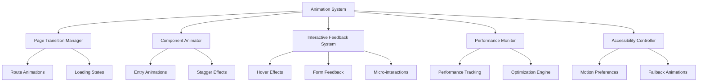

# Design Document: SafePass Framer Motion Enhancements

## Overview

This design implements comprehensive Framer Motion animation enhancements for SafePass, a React-based password security suite. The system provides smooth page transitions, engaging component animations, responsive interactive feedback, and optimized performance while maintaining accessibility standards and the existing cybersecurity aesthetic.

The animation system leverages Framer Motion's latest API features including variants, stagger animations, and gesture handling to create a professional, polished user experience that enhances rather than distracts from the application's security-focused functionality.

## Architecture

### Core Animation Architecture

The animation system follows a modular architecture with specialized managers for different animation concerns:



### Animation Hierarchy

The system implements a three-tier animation hierarchy:

1. **Global Animations**: Page transitions, route changes, and app-wide loading states
2. **Component Animations**: Individual component entry/exit animations and state changes
3. **Element Animations**: Micro-interactions, hover effects, and form feedback

### State Management Integration

Animation states integrate with React's component lifecycle and state management:

- **Animation Variants**: Centralized animation definitions using Framer Motion variants
- **Context Providers**: Global animation preferences and performance settings
- **Custom Hooks**: Reusable animation logic for common patterns

## Components and Interfaces

### Core Animation Components

#### AnimationProvider
```typescript
interface AnimationProviderProps {
  children: React.ReactNode;
  reducedMotion?: boolean;
  performanceMode?: 'high' | 'balanced' | 'low';
}

const AnimationProvider: React.FC<AnimationProviderProps>
```

Provides global animation context including motion preferences, performance settings, and shared animation variants.

#### PageTransition
```typescript
interface PageTransitionProps {
  children: React.ReactNode;
  transitionKey: string;
  variant?: 'slide' | 'fade' | 'scale';
}

const PageTransition: React.FC<PageTransitionProps>
```

Manages route-level transitions with customizable animation variants optimized for different page types.

#### StaggerContainer
```typescript
interface StaggerContainerProps {
  children: React.ReactNode;
  staggerDelay?: number;
  viewport?: boolean;
  once?: boolean;
}

const StaggerContainer: React.FC<StaggerContainerProps>
```

Orchestrates staggered animations for child components with viewport detection and performance optimization.

#### AnimatedButton
```typescript
interface AnimatedButtonProps extends ButtonHTMLAttributes<HTMLButtonElement> {
  variant?: 'primary' | 'secondary' | 'ghost';
  loading?: boolean;
  glowEffect?: boolean;
}

const AnimatedButton: React.FC<AnimatedButtonProps>
```

Enhanced button component with hover effects, loading states, and cybersecurity-themed glow animations.

#### FormField
```typescript
interface FormFieldProps {
  children: React.ReactNode;
  error?: string;
  success?: boolean;
  focused?: boolean;
}

const FormField: React.FC<FormFieldProps>
```

Animated form field wrapper providing focus animations, validation feedback, and state transitions.

### Animation Hooks

#### useReducedMotion
```typescript
const useReducedMotion: () => boolean
```

Detects user motion preferences and provides boolean flag for conditional animation logic.

#### useStaggerAnimation
```typescript
interface StaggerConfig {
  delay?: number;
  duration?: number;
  ease?: string;
}

const useStaggerAnimation: (itemCount: number, config?: StaggerConfig) => MotionValue[]
```

Generates staggered animation values for collections of components.

#### useScrollAnimation
```typescript
interface ScrollAnimationConfig {
  threshold?: number;
  triggerOnce?: boolean;
  rootMargin?: string;
}

const useScrollAnimation: (config?: ScrollAnimationConfig) => {
  ref: RefObject<HTMLElement>;
  inView: boolean;
  controls: AnimationControls;
}
```

Provides scroll-triggered animations with intersection observer integration.

## Data Models

### Animation Variants

#### Global Variants
```typescript
const globalVariants = {
  pageEnter: {
    initial: { opacity: 0, y: 20 },
    animate: { opacity: 1, y: 0 },
    exit: { opacity: 0, y: -20 },
    transition: { duration: 0.3, ease: "easeOut" }
  },
  
  staggerContainer: {
    animate: {
      transition: {
        staggerChildren: 0.1,
        delayChildren: 0.2
      }
    }
  },
  
  staggerItem: {
    initial: { opacity: 0, y: 30 },
    animate: { opacity: 1, y: 0 },
    transition: { duration: 0.4, ease: "easeOut" }
  }
}
```

#### Component-Specific Variants
```typescript
const heroVariants = {
  title: {
    initial: { opacity: 0, y: 50 },
    animate: { opacity: 1, y: 0 },
    transition: { duration: 0.6, ease: "easeOut" }
  },
  
  subtitle: {
    initial: { opacity: 0, y: 30 },
    animate: { opacity: 1, y: 0 },
    transition: { duration: 0.5, delay: 0.2, ease: "easeOut" }
  },
  
  decorations: {
    initial: { scale: 0, rotate: -180 },
    animate: { scale: 1, rotate: 0 },
    transition: { duration: 0.8, delay: 0.4, ease: "backOut" }
  }
}
```

#### Interactive Variants
```typescript
const interactiveVariants = {
  button: {
    rest: { scale: 1, boxShadow: "0 0 0 rgba(139, 92, 246, 0)" },
    hover: { 
      scale: 1.05, 
      boxShadow: "0 0 20px rgba(139, 92, 246, 0.3)",
      transition: { duration: 0.2 }
    },
    tap: { scale: 0.95 }
  },
  
  formField: {
    unfocused: { 
      borderColor: "rgba(139, 92, 246, 0.2)",
      boxShadow: "0 0 0 rgba(139, 92, 246, 0)"
    },
    focused: { 
      borderColor: "rgba(139, 92, 246, 1)",
      boxShadow: "0 0 10px rgba(139, 92, 246, 0.2)",
      transition: { duration: 0.2 }
    }
  }
}
```

### Performance Configuration
```typescript
interface PerformanceConfig {
  maxConcurrentAnimations: number;
  frameRateTarget: number;
  enableGPUAcceleration: boolean;
  reducedMotionFallbacks: boolean;
}

const performanceSettings: PerformanceConfig = {
  maxConcurrentAnimations: 10,
  frameRateTarget: 60,
  enableGPUAcceleration: true,
  reducedMotionFallbacks: true
}
```

### Accessibility Configuration
```typescript
interface AccessibilityConfig {
  respectReducedMotion: boolean;
  fallbackDuration: number;
  maintainFocus: boolean;
  announceStateChanges: boolean;
}

const accessibilitySettings: AccessibilityConfig = {
  respectReducedMotion: true,
  fallbackDuration: 0.1,
  maintainFocus: true,
  announceStateChanges: true
}
```

## Implementation Strategy

### Page-Level Animations

#### Route Transitions
Each page transition uses AnimatePresence with custom variants:

```typescript
const pageTransitionVariants = {
  initial: { opacity: 0, x: 100 },
  in: { opacity: 1, x: 0 },
  out: { opacity: 0, x: -100 }
}
```

Route transitions maintain visual continuity while providing clear navigation feedback. The system uses transform properties exclusively to avoid layout thrashing.

#### Loading States
Global loading states use skeleton animations and progress indicators:

```typescript
const loadingVariants = {
  pulse: {
    opacity: [0.5, 1, 0.5],
    transition: { duration: 1.5, repeat: Infinity }
  },
  
  progress: {
    scaleX: [0, 1],
    transition: { duration: 2, ease: "easeInOut" }
  }
}
```

### Component-Level Animations

#### Hero Section Enhancement
The hero section implements cascading text animations with decorative elements:

- **Title Animation**: Staggered character or word animations
- **Subtitle Animation**: Delayed fade-in with upward motion
- **Decoration Animation**: Scale and rotation effects with spring physics
- **Button Animation**: Hover effects with glow and scale

#### Feature Cards System
Feature cards use intersection observer for viewport-triggered animations:

- **Container**: Stagger children with configurable delays
- **Individual Cards**: Lift effect on hover with enhanced shadows
- **Icons**: Rotation or scale animations on card hover
- **Content**: Fade-in animations for text elements

#### Form Enhancement System
Forms receive comprehensive animation treatment:

- **Field Focus**: Border color transitions with glow effects
- **Validation**: Error/success state animations with color changes
- **Submit States**: Loading button animations with spinner integration
- **Success Feedback**: Confirmation animations with checkmark effects

### Specialized Animations

#### Password Generator Enhancements
The password generator receives targeted animation improvements:

- **Strength Meter**: Smooth progress bar animations with color transitions
- **Copy Feedback**: Brief scale animation with success indicator
- **Slider Interactions**: Real-time value updates with smooth transitions
- **Breach Check**: Loading spinner with security-themed styling

#### Navigation Animations
Navigation components get enhanced interactivity:

- **Mobile Menu**: Slide-in/out animations with backdrop blur
- **Active Indicators**: Smooth position transitions for current page
- **Scroll Effects**: Header transparency and size changes
- **Menu Items**: Hover effects with underline animations

### Performance Optimization Strategy

#### GPU Acceleration
All animations use transform and opacity properties to leverage GPU acceleration:

```typescript
const optimizedVariants = {
  // Good: Uses transform properties
  slideIn: {
    x: [100, 0],
    opacity: [0, 1]
  },
  
  // Avoid: Causes layout recalculation
  // width: [0, 200] // Don't use this
}
```

#### Animation Cleanup
Proper cleanup prevents memory leaks:

```typescript
useEffect(() => {
  const controls = animation.start();
  
  return () => {
    controls.stop();
  };
}, [animation]);
```

#### Concurrent Animation Limiting
The system monitors and limits concurrent animations to maintain performance:

```typescript
const animationQueue = {
  maxConcurrent: 8,
  queue: [],
  active: new Set()
}
```

### Accessibility Implementation

#### Reduced Motion Support
The system detects and respects user motion preferences:

```typescript
const useReducedMotion = () => {
  const [prefersReducedMotion, setPrefersReducedMotion] = useState(false);
  
  useEffect(() => {
    const mediaQuery = window.matchMedia('(prefers-reduced-motion: reduce)');
    setPrefersReducedMotion(mediaQuery.matches);
    
    const handleChange = () => setPrefersReducedMotion(mediaQuery.matches);
    mediaQuery.addEventListener('change', handleChange);
    
    return () => mediaQuery.removeEventListener('change', handleChange);
  }, []);
  
  return prefersReducedMotion;
};
```

#### Fallback Animations
When reduced motion is preferred, the system provides simplified alternatives:

```typescript
const getAnimationVariant = (reducedMotion: boolean) => ({
  animate: reducedMotion 
    ? { opacity: 1 } // Simple fade
    : { opacity: 1, y: 0, scale: 1 } // Full animation
});
```

#### Focus Management
Animations maintain proper focus management for keyboard navigation:

```typescript
const AnimatedComponent = ({ children }) => {
  const ref = useRef();
  
  useEffect(() => {
    // Ensure focus is maintained during animations
    if (document.activeElement && ref.current?.contains(document.activeElement)) {
      document.activeElement.focus();
    }
  });
  
  return <motion.div ref={ref}>{children}</motion.div>;
};
```
## Correctness Properties

*A property is a characteristic or behavior that should hold true across all valid executions of a system—essentially, a formal statement about what the system should do. Properties serve as the bridge between human-readable specifications and machine-verifiable correctness guarantees.*

### Property 1: Page Transition Consistency
*For any* route navigation in the application, all page transitions should use consistent timing, easing, and visual continuity without causing layout shifts.
**Validates: Requirements 1.1, 1.2, 1.3**

### Property 2: Viewport-Triggered Animation Staggering
*For any* collection of components entering the viewport, staggered entry animations should trigger with proper sequential delays and respect scroll position optimization.
**Validates: Requirements 2.1, 2.3, 2.5**

### Property 3: Interactive Feedback Responsiveness
*For any* user interaction with buttons or interactive elements, immediate visual feedback should be provided with scale, glow, or confirmation effects consistent with the cybersecurity theme.
**Validates: Requirements 3.1, 3.3, 9.5**

### Property 4: Form Animation Completeness
*For any* form interaction including focus, validation, and submission, appropriate animations should trigger for focus states, error/success feedback, and loading states.
**Validates: Requirements 3.2, 3.4, 6.1, 6.2, 6.4, 6.5**

### Property 5: Loading State Animation Consistency
*For any* asynchronous operation in the application, animated loading indicators should appear and animate properly during the operation duration.
**Validates: Requirements 1.4, 4.4, 6.3, 10.3**

### Property 6: Password Generator Animation Integration
*For any* password generator interaction including strength changes, slider adjustments, and password generation, smooth animations should provide appropriate visual feedback.
**Validates: Requirements 4.1, 4.3, 4.5**

### Property 7: Copy Operation Feedback Consistency
*For any* copy operation in the application, animated confirmation feedback should display briefly to confirm the action completion.
**Validates: Requirements 3.5, 4.2, 10.1**

### Property 8: Navigation Animation Smoothness
*For any* navigation interaction including mobile menu toggles, page indicators, and smooth scrolling, animations should provide smooth transitions optimized for the device type.
**Validates: Requirements 5.1, 5.2, 5.3, 5.4, 5.5**

### Property 9: Performance Optimization Compliance
*For any* animation in the system, only transform and opacity properties should be used to maintain 60fps performance with proper cleanup and memory management.
**Validates: Requirements 7.1, 7.2, 7.3, 7.4, 7.5**

### Property 10: Accessibility Motion Preference Respect
*For any* user with reduced motion preferences enabled, the system should detect the preference and provide simplified or alternative animations while maintaining full functionality.
**Validates: Requirements 8.1, 8.2, 8.3, 8.4, 8.5**

### Property 11: Theme Aesthetic Consistency
*For any* animation or interactive effect, the visual styling should maintain consistency with the dark cybersecurity theme using appropriate colors, timing, and effects.
**Validates: Requirements 9.1, 9.2, 9.3, 9.4**

### Property 12: Hero Section Animation Orchestration
*For any* hero section load, title and description text should animate with proper staggered timing and decorative elements should animate appropriately.
**Validates: Requirements 2.2**

### Property 13: Component Entry Animation Coordination
*For any* form or content section display, input fields and form elements should animate into view with proper coordination.
**Validates: Requirements 2.4**

### Property 14: Micro-Interaction Enhancement Balance
*For any* micro-interaction in the application, animations should enhance usability and provide satisfying feedback without becoming distracting or overwhelming.
**Validates: Requirements 10.2, 10.4, 10.5**

## Error Handling

### Animation Failure Recovery
The system implements comprehensive error handling for animation failures:

#### Performance Degradation Response
When frame rates drop below acceptable thresholds:
- Automatically reduce animation complexity
- Disable non-essential animations
- Maintain core functionality without animations
- Log performance metrics for analysis

#### Reduced Motion Fallbacks
When motion preferences are detected:
- Provide instant state changes instead of transitions
- Maintain visual feedback through color/opacity changes
- Preserve all interactive functionality
- Ensure consistent user experience

#### Browser Compatibility Handling
For browsers with limited animation support:
- Graceful degradation to CSS transitions
- Fallback to immediate state changes
- Feature detection for advanced animations
- Progressive enhancement approach

#### Memory Management
Animation cleanup and memory management:
- Automatic cleanup of completed animations
- Prevention of memory leaks through proper disposal
- Monitoring of animation queue size
- Garbage collection optimization

### Error State Animations
Specific error handling for different animation contexts:

#### Form Validation Errors
- Clear visual indication of validation failures
- Smooth transitions to error states
- Accessible error announcements
- Recovery animations when errors are resolved

#### Loading State Errors
- Timeout handling for long-running operations
- Error state animations for failed operations
- Retry mechanisms with appropriate feedback
- Graceful degradation when operations fail

#### Navigation Errors
- Fallback animations for failed route transitions
- Error boundaries for animation components
- Recovery mechanisms for broken navigation states
- Consistent error messaging with animations

## Testing Strategy

### Dual Testing Approach

The testing strategy employs both unit testing and property-based testing to ensure comprehensive coverage of animation functionality.

**Unit Testing Focus:**
- Specific animation sequences and timing
- Component integration with animation systems
- Error conditions and edge cases
- Browser compatibility scenarios
- Accessibility compliance verification

**Property-Based Testing Focus:**
- Universal animation properties across all components
- Performance characteristics under various conditions
- Consistency of animation behavior across different inputs
- Accessibility compliance across different user preferences

### Property-Based Testing Configuration

**Testing Framework:** React Testing Library with Framer Motion testing utilities
**Property Testing Library:** fast-check for JavaScript property-based testing
**Minimum Iterations:** 100 iterations per property test
**Performance Monitoring:** Integration with browser performance APIs

### Test Implementation Requirements

Each correctness property must be implemented as a property-based test with the following configuration:

- **Minimum 100 iterations** per test to ensure comprehensive input coverage
- **Tag format:** `Feature: safepass-framer-motion-enhancements, Property {number}: {property_text}`
- **Performance assertions:** Frame rate monitoring and memory usage validation
- **Accessibility testing:** Automated reduced motion preference simulation
- **Cross-browser validation:** Testing across major browser engines

### Unit Test Categories

**Animation Timing Tests:**
- Verify specific animation durations and delays
- Test stagger timing calculations
- Validate easing function applications

**Integration Tests:**
- Component interaction with animation systems
- State management integration with animations
- Event handling during animated transitions

**Accessibility Tests:**
- Reduced motion preference detection and response
- Focus management during animations
- Keyboard navigation preservation

**Performance Tests:**
- Frame rate monitoring during complex animations
- Memory usage validation for animation cleanup
- CPU usage optimization verification

**Error Handling Tests:**
- Animation failure recovery mechanisms
- Graceful degradation scenarios
- Browser compatibility fallbacks

The testing strategy ensures that animations enhance the user experience while maintaining performance, accessibility, and reliability standards across all supported browsers and devices.